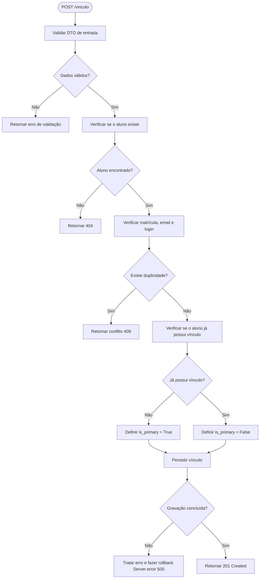

```mermaid
flowchart TD
    A([POST /vinculo]) --> B[Validar DTO de entrada]
    B --> C{Dados válidos?}
    C -- Não --> X[Retornar erro de validação]
    C -- Sim --> D[Verificar se o aluno existe]
    D --> E{Aluno encontrado?}
    E -- Não --> Y[Retornar 404]
    E -- Sim --> F[Verificar matrícula, email e login]
    F --> G{Existe duplicidade?}
    G -- Sim --> Z[Retornar conflito 409]
    G -- Não --> H[Verificar se o aluno já possui vínculo]
    H --> I{Já possui vínculo?}
    I -- Não --> J[Definir is_primary = True]
    I -- Sim --> K[Definir is_primary = False]
    J --> L[Persistir vínculo]
    K --> L
    L --> M{Gravação concluída?}
    M -- Não --> N[Tratar erro e fazer rollback Server error 500]
    M -- Sim --> O[Retornar 201 Created]
```
