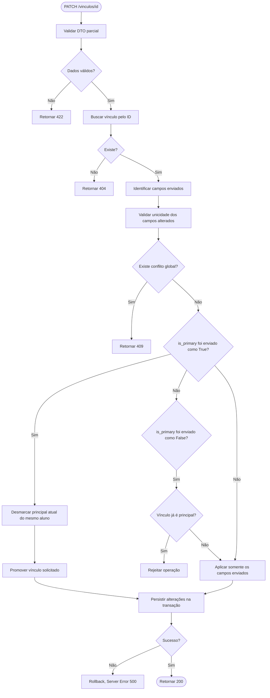

```mermaid

flowchart TD
    A([PATCH /vinculos/id]) --> B[Validar DTO parcial]
    B --> C{Dados válidos?}
    C -- Não --> X[Retornar 422]
    C -- Sim --> D[Buscar vínculo pelo ID]
    D --> E{Existe?}
    E -- Não --> Y[Retornar 404]
    E -- Sim --> F[Identificar campos enviados]
    F --> G[Validar unicidade dos campos alterados]
    G --> H{Existe conflito global?}
    H -- Sim --> Z[Retornar 409]
    H -- Não --> I{is_primary foi enviado como True?}
    I -- Sim --> J[Desmarcar principal atual do mesmo aluno]
    J --> K[Promover vínculo solicitado]
    I -- Não --> L{is_primary foi enviado como False?}
    L -- Sim --> M{Vínculo já é principal?}
    M -- Sim --> N[Rejeitar operação]
    M -- Não --> O[Aplicar somente os campos enviados]
    I -- Não --> O
    K --> P[Persistir alterações na transação]
    O --> P
    P --> Q{Sucesso?}
    Q -- Não --> R[Rollback, Server Error 500]
    Q -- Sim --> S([Retornar 200])
```
